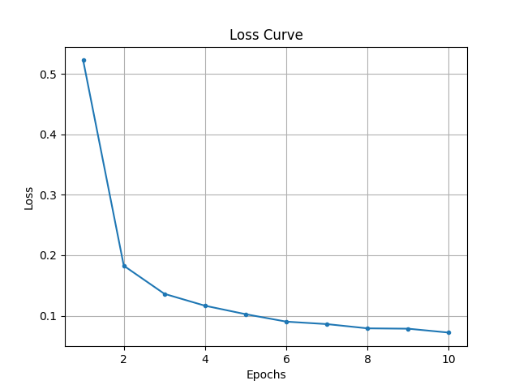
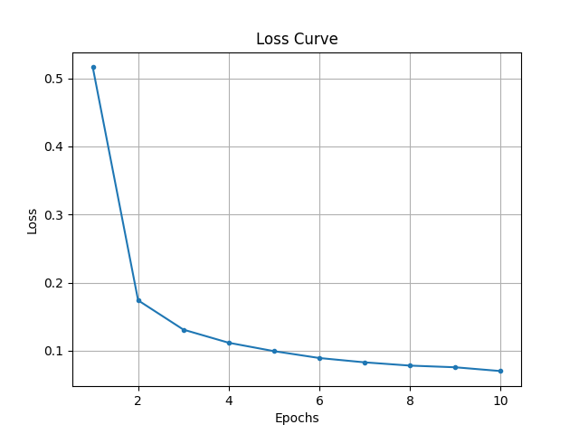

# Task 1: PyTorch Basic Implementation


**lab0的代码和报告在`./lab0_cifar_classification`中**


增加数据增强操作
```python
transform_train = transforms.Compose([
    # Random affine transformation
    transforms.RandomAffine(degrees=15, translate=(0.1, 0.1), scale=(0.8, 1.2)),  
    transforms.ToTensor(),  
    transforms.Normalize((0.5,), (0.5,))  
])
```
运行方法
```shell
python mnist.py
```
运行结果
```
Epoch [1/10], Loss: 0.5223, Dur: 7.861893896013498
Epoch [2/10], Loss: 0.1826, Dur: 7.3599243350327015
Epoch [3/10], Loss: 0.1362, Dur: 7.120721081271768
Epoch [4/10], Loss: 0.1165, Dur: 7.185883884318173
Epoch [5/10], Loss: 0.1025, Dur: 7.234354291576892
Epoch [6/10], Loss: 0.0902, Dur: 7.4026127038523555
Epoch [7/10], Loss: 0.0861, Dur: 7.299837604165077
Epoch [8/10], Loss: 0.0791, Dur: 7.223206660244614
Epoch [9/10], Loss: 0.0785, Dur: 7.219135090243071
Epoch [10/10], Loss: 0.0720, Dur: 7.253873430658132
Total training time: 73.16208029631525s.
Accuracy of the network on the 10000 test images: 99.19%
Accuracy of class 0: 99.49%
Accuracy of class 1: 99.91%
Accuracy of class 2: 98.45%
Accuracy of class 3: 99.60%
Accuracy of class 4: 98.27%
Accuracy of class 5: 98.88%
Accuracy of class 6: 99.37%
Accuracy of class 7: 99.42%
Accuracy of class 8: 98.87%
Accuracy of class 9: 99.50%
```
<figure style="text-align: center;">
  
  <figcaption>Mnist baseline training curve</figcaption>
</figure>

# Task 2: PyTorch Parallel Practice
## 并行准备
确认训练环境，检测当前可用的GPU数量
```python
device = torch.device("cuda" if torch.cuda.is_available() else "cpu")
print("Let's use", torch.cuda.device_count(), "GPUs!")
# 8个H100
```

## 数据并行
**将数据分给不同的GPU，进行同步更新，以并行计算**
### 使用DistributedDataParallel
代码实现
- 用DDP包装整个模型
- 用`DistributedSampler`确保每个卡拿到不同的数据，此时dataloader的batchsize应定义为`batch_size//world_size`
- 在backward之后，进程间(gpu)通过`all-reduce`同步，同时除以`world_size`取平均
- 同步后，每个卡上的梯度一致，运行`optimizer.step()`更新模型参数

运行方法
```shell
torchrun --standalone --nproc_per_node=8 mnist.py
```
运行结果
```
Epoch [1/10], Loss: 0.5043, Dur: 3.078787858132273
Epoch [2/10], Loss: 0.1707, Dur: 2.6075569330714643
Epoch [3/10], Loss: 0.1265, Dur: 2.4371133111417294
Epoch [4/10], Loss: 0.1048, Dur: 2.6616126243025064
Epoch [5/10], Loss: 0.0928, Dur: 2.646245092153549
Epoch [6/10], Loss: 0.0837, Dur: 2.5374715737998486
Epoch [7/10], Loss: 0.0790, Dur: 2.4879325507208705
Epoch [8/10], Loss: 0.0729, Dur: 2.6630166387185454
Epoch [9/10], Loss: 0.0710, Dur: 2.453670894727111
Epoch [10/10], Loss: 0.0687, Dur: 2.538908055983484
Total training time: 26.113313526380807s.
Accuracy of the network on the 10000 test images: 98.93%
Accuracy of class 0: 99.39%
Accuracy of class 1: 99.74%
Accuracy of class 2: 99.42%
Accuracy of class 3: 99.11%
Accuracy of class 4: 99.19%
Accuracy of class 5: 99.33%
Accuracy of class 6: 98.75%
Accuracy of class 7: 98.74%
Accuracy of class 8: 99.38%
Accuracy of class 9: 96.23%
```
<figure style="text-align: center;">
  
  <figcaption>Mnist DDP training curve</figcaption>
</figure>

### 使用DataParallel
设置Data parallel
```python
model = nn.DataParallel(model)
```
打印模型输入数据的大小
```python
class LeNet(nn.Module):
    ···
    def forward(self, x):
        ···
        print("\tIn Model: output size", x.size())
        return x
# In Model: output size torch.Size([4, 10])
# Batch_size设置为32，在串行训练时输入数据大小即为32条
# Data parallel数据均匀分给每个GPU，并行计算，同步更新
```
运行方法
```shell
python mnist.py --mode DP
```
运行结果
```
Let's use 8 GPUs!
Epoch [1/10], Loss: 0.5163, Dur: 26.228063262999058
Epoch [2/10], Loss: 0.1740, Dur: 14.841202991083264
Epoch [3/10], Loss: 0.1309, Dur: 15.105411913245916
Epoch [4/10], Loss: 0.1116, Dur: 15.011387773323804
Epoch [5/10], Loss: 0.0993, Dur: 14.954337451141328
Epoch [6/10], Loss: 0.0892, Dur: 14.776632377877831
Epoch [7/10], Loss: 0.0828, Dur: 15.171749539207667
Epoch [8/10], Loss: 0.0781, Dur: 14.937090698163956
Epoch [9/10], Loss: 0.0756, Dur: 15.113445749040693
Epoch [10/10], Loss: 0.0700, Dur: 14.742029211949557
Total training time: 160.88189983181655s.
Accuracy of the network on the 10000 test images: 98.94%
Accuracy of class 0: 100.00%
Accuracy of class 1: 99.47%
Accuracy of class 2: 99.03%
Accuracy of class 3: 98.51%
Accuracy of class 4: 98.68%
Accuracy of class 5: 98.54%
Accuracy of class 6: 98.75%
Accuracy of class 7: 98.44%
Accuracy of class 8: 98.87%
Accuracy of class 9: 99.01%
```

<figure style="text-align: center;">
  
  <figcaption>Mnist DP training curve</figcaption>
</figure>

## 性能对比
**对比并行化前后的训练速度和准确率**

1. 从准确率上看，`baseline`、`DataParallel`和`DistributedDataParallel`训练得到的模型表现相仿
2. 从训练速度上看，`DataParallel`训练速度反而变慢，而`DistributedDataParallel`相比`baseline`训练速度更快

| Method                  | Accuracy | Time  |
|-------------------------|----------|-------|
| Baseline                | 99.19%   | 73s   |
| DistributedDataParallel | 98.93%   | 26s   |
| DataParallel            | 98.94%   | 161s  |

### DDP加速训练的原因
#### 数据并行并没有提高训练速度
- 理论上只起一个进程做数据并行，应该与`baseline`一致
- 实际上，反而训练速度比八个卡数据并行还要快
  ```shell
  # 尝试只起一个进程
  torchrun --standalone --nproc_per_node=1 mnist.py
  # Total training time: 20.265355579089373s.
  # Accuracy of the network on the 10000 test images: 99.09%

  # 先前运行八个进程
  torchrun --standalone --nproc_per_node=8 mnist.py
  # Total training time: 26.113313526380807s.
  # Accuracy of the network on the 10000 test images: 98.93%  
  ```
#### DataLoader加载数据集速度决定整体的训练速度，而且受到`num_workers`参数的影响
- 运行baseline程序，修改num_workers参数，同时测量加载数据集，即`for data, labels in train_loader:`这一行代码所需时间，和梯度计算与更新模型的时间
  ```
  python mnist.py --mode base --num_workers 4
  ```
- 当设置dataloader参数`num_workers = 0`时，训练速度与先前一致，而其中每个循环中，加载数据的时间是计算与更新模型所需时间的**六倍**
- 当设置dataloader参数`num_workers = 4`时，训练速度略快于`DDP`，而其中每个循环中，加载数据的时间**显著小于**计算与更新模型所需时间

| **num_workers** | **Load Time** | **Update Time** | **Total Training Time** | **Accuracy(%)** |
|-----------------|----------------------|------------------------|-----------------------------|----------------------------------------|
| 0               | 0.0064               | 0.0011                 | 72.80                       | 99.08                                  |
| 2               | 0.0043               | 0.0012                 | 34.96                       | 99.10                                  |
| 4               | 0.0005               | 0.0012                 | 18.47                       | 99.07                                  |

- 当从预处理步骤中去除随机仿射变换之后，发现加载和预处理数据集的时间显著缩短，可见每一批次数据的加载和预处理是实时进行的，而且在此处是主要耗时的步骤
  ```
  num_workers=0
  预处理包括随机仿射变换
  time of load: 0.006419152021408081
  预处理去除随机仿射变换
  time of load: 0.00330487173050642
  ```

#### 结论
1. 在手写数字分类这个训练任务中，`batch_size`较小，每个循环的计算量小，所以从内存中加载下一批次的数据，然后进行预处理等操作需要的时间决定了整个训练的速度，所以通过并行计算每个batch梯度提升运算速度的数据并行，并没有显著影响整体的训练速度。在大模型训练中，`batch_size`是百兆量级，数据并行会起到较大的加速作用。
2. `DataLoader`的`num_workers`参数，在默认情况下，`num_workers = 0`，即数据加载是由主进程单线程完成的。当`num_workers > 0`时，可以启动多个子进程并行加载和预处理数据。这样一则可以加快加载和预处理的速度，一则可以与模型训练并行进行，进而减少主进程在等待数据时的空闲时间，特别是在数据预处理和从磁盘读取数据的情况下。
3. 先前实验中`DDP`快于`baseline`是因为`DDP`的dataloader设置`num_workers = 4`，而`baseline`则采用默认参数，即`num_workers = 0`，**训练速度提高的原因是数据集加载和预处理能够并行化加速**。当调整`baseline`的dataloader设置为`num_workers = 4`后，其训练用时为18s，快于`DDP`训练用时26s，说明数据并行带来了额外的`overhead`，并不适用于Mnist手写数字分类，这样一个模型简单、batch_size小、计算量小的任务情景。

    | Method                             | num_workers | Total Training Time (s) | Accuracy on Test Images |
    |------------------------------------|------------|--------------------------|-------------------------|
    | DDP with 1 process                    | 0          | 75.58                    | 99.09%                  |
    | Baseline             | 0          | 72.80                    | 99.08%                  |
    | DDP with 1 process      | 4          | 20.27                    | 99.09%                  |
    | Baseline            | 4          | 18.47                    | 99.07%                  |


### DP训练速度变慢的原因

经过检验`outputs = model(inputs)`确实将一个batch的数据均匀分给每张卡进行计算，并将计算结果gather到`cuda:0`上，进行后续计算。查看gpu占用情况，可以看到运行过程中每张卡显存占用比较均衡，但运算负载主要集中在`cuda:0`上，这是因为`cuda:0`在收集每张卡计算结果后，要计算loss、gradient并更新权重，然后将新权重发送到其他卡上。
```shell
# 每张卡显存占用相似
# gpu利用率在cuda:0为8%，在其他卡均为1%
watch -n 1 nvidia-smi
```
与之对比，DDP中每张卡gpu利用率均可达到40-60%。因此，DP训练速度慢，一则因为DP只起了一个进程，通讯和数据传输的负担较大，相对而言对较小的`batch`做数据并行对运算速度提升作用小，一则因为DP本身没能充分利用gpu的算力，存在优化问题。


# Task 3: Custom Implementation
## 整体思路
1. 为了充分利用作业四的自动微分框架，我定义`Conv2D`和`MaxPooling`两个继承自`TensorOp`的算子，其中`compute`正向传播和`gradient`反向传播均使用作业三编译好的卷积层和池化层的cuda实现（`MaxPooling`反向传播在作业三没有实现CUDA版本，在此处我实现了`for-loop`和`CUDA`两个版本，并进行实验比较）。
2. 利用作业五的优化器，实现三种模型架构：两层线性层的`pure_linear`架构、一层卷积层两层线性层的`simple_conv`架构、`LeNet`模型架构。具体来讲，对于每种架构，需要在`set_structure`中增加模型权重，更改`forward`函数，在优化器中更新每一层的权重。
3. 为了适配各种模型架构，避免模型架构改变之后需要相应改变优化器的权重更新代码，我通过遍历模型所有权重，实现适配所有模型架构的更一般的参数更新策略。
3. 实验发现我写的for-loop版本池化层反向传播耗时较多，所以我实现了CUDA并行的池化层反向传播，实验发现能显著提高运行速度。

## 代码结构
- CUDA代码在`./MyTensor`中，运行`python setup.py develop`即可编译
- 模型训练的代码位于`./task1_optimizer.py`中，运行`python task1_optimizer.py --model simple_conv`可训练具有一层卷积层两层线性层的`simple_conv`架构的模型，`--model`还可以选择`pure_linear`和`LeNet`模型架构

## 运行方法与结果
如果出现报错，可以尝试`cd ./MyTensor`运行`python setup.py develop`重新编译
### pure_linear
```shell
python task1_optimizer.py --model pure_linear
```
| Epoch | Train Loss | Train Err | Test Loss | Test Err | Epoch Time |
|-------|------------|-----------|-----------|----------|------------|
| 0     | 0.22435    | 0.06470   | 0.22508   | 0.06670  | 0.94579    |
| 1     | 0.14339    | 0.04090   | 0.15038   | 0.04400  | 0.73822    |
| 2     | 0.10491    | 0.02972   | 0.11988   | 0.03450  | 0.73497    |
| 3     | 0.08210    | 0.02337   | 0.10400   | 0.03100  | 0.67366    |
| 4     | 0.06755    | 0.01910   | 0.09560   | 0.02900  | 0.66912    |
| 5     | 0.05743    | 0.01633   | 0.09076   | 0.02730  | 0.73319    |
| 6     | 0.05035    | 0.01430   | 0.08808   | 0.02680  | 0.69270    |
| 7     | 0.04512    | 0.01305   | 0.08606   | 0.02610  | 0.70101    |
| 8     | 0.04096    | 0.01138   | 0.08459   | 0.02540  | 0.67365    |
| 9     | 0.03789    | 0.01022   | 0.08348   | 0.02480  | 0.68011    |
| 10    | 0.03506    | 0.00897   | 0.08228   | 0.02400  | 0.69014    |
| 11    | 0.03228    | 0.00802   | 0.08065   | 0.02410  | 0.66409    |
| 12    | 0.02955    | 0.00692   | 0.07888   | 0.02290  | 0.67286    |
| 13    | 0.02747    | 0.00615   | 0.07734   | 0.02260  | 0.74242    |
| 14    | 0.02596    | 0.00552   | 0.07636   | 0.02260  | 0.69701    |
| 15    | 0.02488    | 0.00525   | 0.07582   | 0.02270  | 0.64889    |
| 16    | 0.02410    | 0.00498   | 0.07548   | 0.02210  | 0.65099    |
| 17    | 0.02358    | 0.00487   | 0.07537   | 0.02200  | 0.72380    |
| 18    | 0.02325    | 0.00473   | 0.07532   | 0.02200  | 0.68885    |
| 19    | 0.02304    | 0.00465   | 0.07533   | 0.02200  | 0.69484    |


### simple_conv
```shell
python task1_optimizer.py --model simple_conv
```
| Epoch | Train Loss | Train Err | Test Loss | Test Err | Epoch Time |
|-------|------------|-----------|-----------|----------|------------|
| 0     | 0.22450    | 0.06557   | 0.22500   | 0.06870  | 4.74313    |
| 1     | 0.14129    | 0.04207   | 0.14670   | 0.04590  | 3.82161    |
| 2     | 0.10393    | 0.03257   | 0.11608   | 0.03600  | 4.41619    |
| 3     | 0.07885    | 0.02458   | 0.09998   | 0.03100  | 3.74715    |
| 4     | 0.06369    | 0.02007   | 0.09137   | 0.02800  | 3.64345    |
| 5     | 0.05231    | 0.01648   | 0.08724   | 0.02600  | 4.47715    |
| 6     | 0.04462    | 0.01400   | 0.08595   | 0.02530  | 4.18614    |
| 7     | 0.03778    | 0.01160   | 0.08470   | 0.02450  | 3.89238    |
| 8     | 0.03306    | 0.01043   | 0.08597   | 0.02510  | 3.80926    |
| 9     | 0.02982    | 0.00972   | 0.08827   | 0.02500  | 3.72024    |
| 10    | 0.02689    | 0.00833   | 0.08952   | 0.02460  | 4.40014    |
| 11    | 0.02264    | 0.00687   | 0.08822   | 0.02400  | 3.86780    |
| 12    | 0.01881    | 0.00515   | 0.08613   | 0.02290  | 3.90654    |
| 13    | 0.01623    | 0.00425   | 0.08498   | 0.02230  | 3.68627    |
| 14    | 0.01437    | 0.00360   | 0.08466   | 0.02190  | 3.52239    |
| 15    | 0.01296    | 0.00313   | 0.08437   | 0.02200  | 3.93964    |
| 16    | 0.01189    | 0.00277   | 0.08417   | 0.02200  | 3.79612    |
| 17    | 0.01113    | 0.00247   | 0.08417   | 0.02170  | 3.68573    |
| 18    | 0.01063    | 0.00225   | 0.08426   | 0.02180  | 4.57585    |
| 19    | 0.01031    | 0.00215   | 0.08432   | 0.02180  | 3.90759    |


### LeNet
```shell
python task1_optimizer.py --model LeNet
```

| Epoch | Train Loss | Train Err | Test Loss | Test Err | Epoch Time |
|-------|------------|-----------|-----------|----------|------------|
| 0     | 0.12592    | 0.04002   | 0.11623   | 0.03650  | 273.73302  |
| 1     | 0.07156    | 0.02250   | 0.07054   | 0.02180  | 271.74698  |
| 2     | 0.05404    | 0.01745   | 0.05941   | 0.02020  | 272.00233  |
| 3     | 0.05036    | 0.01662   | 0.06030   | 0.01930  | 272.11799  |
| 4     | 0.03622    | 0.01162   | 0.05037   | 0.01680  | 272.21837  |
| 5     | 0.03278    | 0.01103   | 0.05229   | 0.01790  | 259.61811  |
| 6     | 0.02956    | 0.01058   | 0.05080   | 0.01600  | 225.49822  |
| 7     | 0.02046    | 0.00718   | 0.04375   | 0.01330  | 227.44083  |
| 8     | 0.01514    | 0.00523   | 0.04190   | 0.01190  | 228.30170  |
| 9     | 0.01241    | 0.00428   | 0.04323   | 0.01140  | 229.07684  |
| 10    | 0.00949    | 0.00317   | 0.04298   | 0.01080  | 225.78679  |
| 11    | 0.00867    | 0.00290   | 0.04391   | 0.01150  | 228.54179  |
| 12    | 0.00779    | 0.00245   | 0.04425   | 0.01120  | 232.68834  |
| 13    | 0.00618    | 0.00183   | 0.04338   | 0.01130  | 226.14438  |
| 14    | 0.00507    | 0.00148   | 0.04325   | 0.01060  | 228.71153  |
| 15    | 0.00424    | 0.00113   | 0.04321   | 0.01010  | 230.34282  |
| 16    | 0.00348    | 0.00090   | 0.04283   | 0.01030  | 226.27458  |
| 17    | 0.00281    | 0.00062   | 0.04210   | 0.01000  | 228.54181  |
| 18    | 0.00234    | 0.00038   | 0.04137   | 0.00950  | 232.39875  |
| 19    | 0.00204    | 0.00028   | 0.04076   | 0.00930  | 228.27878  |

## 分析
- 从loss和err的变化，可以看到在模型变得更加复杂后，过拟合现象有所减弱，在测试集的表现也逐渐增强
- 从每个epoch的用时可以看出，加入卷积层后耗时明显变长。测量前向传播和反向传播的耗时可以看出，反向传播速度明显慢于前向传播，而反向传播过程中耗时主要集中在两个池化层的反向传播。这是因为在作业三中我们没有用CUDA实现并行的池化层反向传播，我在`MaxPooling`算子类中，用`for-loop`写的反向传播效率很低，导致耗时较长
    ```
    Using LeNet & for-loop version max-pooling backpropagation
    forward: 0.005983706563711166
    back pool: 0.1325874626636505
    back pool: 0.2950657308101654
    back: 0.4422866702079773
    ```

## 优化：池化层反向传播的CUDA实现
- 将池化层反向传播写成cuda并行，代码实现位于`./MyTensor/max_pooling.cu`。实验发现，池化层反向传播速度显著加快
    ```
    Using LeNet & CUDA version max-pooling backpropagation
    forward: 0.005050960928201675s
    back pool: 0.00039035454392433167s
    back pool: 0.00021830201148986816s
    backward: 0.011350210756063461s
    ```
- 运行结果：`LeNet`运行速度显著提升

| Epoch | Train Loss | Train Err | Test Loss | Test Err | Epoch Time |
|-------|------------|-----------|-----------|----------|------------|
|     0 |    0.12182 |   0.03867 |   0.11171 |  0.03810 | 12.43567 |
|     1 |    0.09300 |   0.02955 |   0.09290 |  0.03130 | 10.14336 |
|     2 |    0.06708 |   0.02175 |   0.07414 |  0.02490 | 10.56740 |
|     3 |    0.04720 |   0.01587 |   0.05948 |  0.02000 | 11.49345 |
|     4 |    0.03722 |   0.01222 |   0.05350 |  0.01740 |  9.54382 |
|     5 |    0.02723 |   0.00885 |   0.04619 |  0.01460 | 10.21054 |
|     6 |    0.02569 |   0.00862 |   0.04632 |  0.01440 | 10.71043 |
|     7 |    0.02027 |   0.00713 |   0.04293 |  0.01300 |  9.08935 |
|     8 |    0.01958 |   0.00703 |   0.04597 |  0.01310 | 10.70305 |
|     9 |    0.01724 |   0.00625 |   0.04619 |  0.01250 | 10.34052 |
|    10 |    0.01540 |   0.00542 |   0.05072 |  0.01230 |  8.74703 |
|    11 |    0.01436 |   0.00493 |   0.05529 |  0.01270 |  9.36119 |
|    12 |    0.01031 |   0.00353 |   0.05160 |  0.01110 |  9.06001 |
|    13 |    0.00801 |   0.00277 |   0.05111 |  0.01030 |  9.56766 |
|    14 |    0.00547 |   0.00182 |   0.04967 |  0.01020 |  9.85894 |
|    15 |    0.00370 |   0.00125 |   0.04940 |  0.00970 | 10.34537 |
|    16 |    0.00264 |   0.00053 |   0.04929 |  0.00960 |  9.43985 |
|    17 |    0.00200 |   0.00035 |   0.04883 |  0.00970 | 10.09448 |
|    18 |    0.00163 |   0.00028 |   0.04859 |  0.00950 | 10.13023 |
|    19 |    0.00144 |   0.00018 |   0.04830 |  0.00960 |  9.29091 |