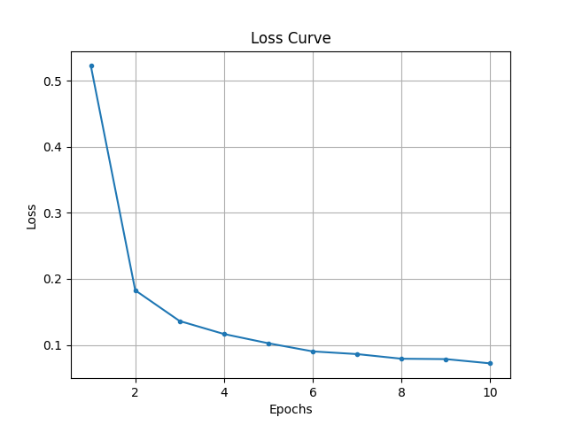

# Task 1: PyTorch Basic Implementation
**lab0的代码和报告在`./lab0_cifar_classification`中**

将原先的cifar数据集改为mnist，相应地修改模型架构，并增加数据增强操作
```python
transform_train = transforms.Compose([
    # Random affine transformation
    transforms.RandomAffine(degrees=15, translate=(0.1, 0.1), scale=(0.8, 1.2)),  
    transforms.ToTensor(),  
    transforms.Normalize((0.5,), (0.5,))  
])
```
运行方法
```shell
python mnist.py
```
运行结果
```
Epoch [1/10], Loss: 0.5223, Dur: 7.861893896013498
Epoch [2/10], Loss: 0.1826, Dur: 7.3599243350327015
Epoch [3/10], Loss: 0.1362, Dur: 7.120721081271768
Epoch [4/10], Loss: 0.1165, Dur: 7.185883884318173
Epoch [5/10], Loss: 0.1025, Dur: 7.234354291576892
Epoch [6/10], Loss: 0.0902, Dur: 7.4026127038523555
Epoch [7/10], Loss: 0.0861, Dur: 7.299837604165077
Epoch [8/10], Loss: 0.0791, Dur: 7.223206660244614
Epoch [9/10], Loss: 0.0785, Dur: 7.219135090243071
Epoch [10/10], Loss: 0.0720, Dur: 7.253873430658132
Total training time: 73.16208029631525s.
Accuracy of the network on the 10000 test images: 99.19%
Accuracy of class 0: 99.49%
Accuracy of class 1: 99.91%
Accuracy of class 2: 98.45%
Accuracy of class 3: 99.60%
Accuracy of class 4: 98.27%
Accuracy of class 5: 98.88%
Accuracy of class 6: 99.37%
Accuracy of class 7: 99.42%
Accuracy of class 8: 98.87%
Accuracy of class 9: 99.50%
```
<figure style="text-align: center;">
  
  <figcaption>Mnist baseline training curve</figcaption>
</figure>