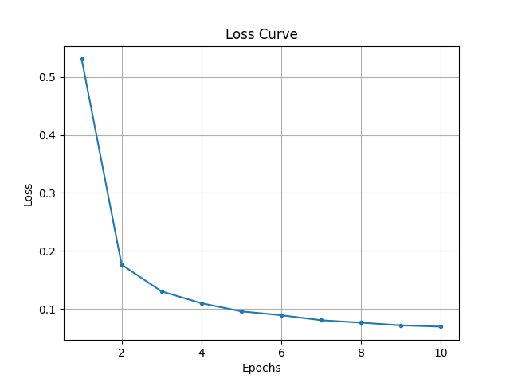
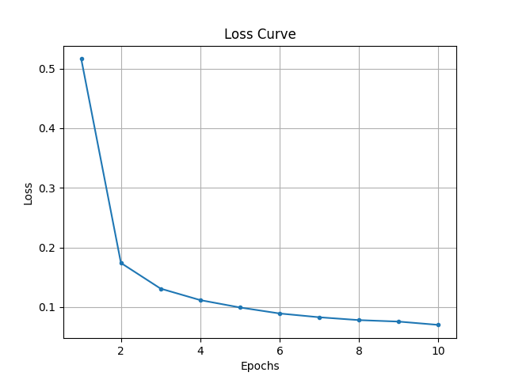

# Task 2: PyTorch Parallel Practice
## 并行准备
确认训练环境，检测当前可用的GPU数量
```python
device = torch.device("cuda" if torch.cuda.is_available() else "cpu")
print("Let's use", torch.cuda.device_count(), "GPUs!")
# 8个H100
```

## 数据并行
**将数据分给不同的GPU，进行同步更新，以并行计算**
### 使用DistributedDataParallel
代码实现
- 用DDP包装整个模型
- 用`DistributedSampler`确保每个卡拿到不同的数据，此时dataloader的batchsize应定义为`batch_size//world_size`
- 在backward之后，进程间(gpu)通过`all-reduce`同步，同时除以`world_size`取平均
- 同步后，每个卡上的梯度一致，运行`optimizer.step()`更新模型参数

运行方法
```shell
torchrun --standalone --nproc_per_node=8 mnist.py
```
运行结果
```
Epoch [1/10], Loss: 0.5043, Dur: 3.078787858132273
Epoch [2/10], Loss: 0.1707, Dur: 2.6075569330714643
Epoch [3/10], Loss: 0.1265, Dur: 2.4371133111417294
Epoch [4/10], Loss: 0.1048, Dur: 2.6616126243025064
Epoch [5/10], Loss: 0.0928, Dur: 2.646245092153549
Epoch [6/10], Loss: 0.0837, Dur: 2.5374715737998486
Epoch [7/10], Loss: 0.0790, Dur: 2.4879325507208705
Epoch [8/10], Loss: 0.0729, Dur: 2.6630166387185454
Epoch [9/10], Loss: 0.0710, Dur: 2.453670894727111
Epoch [10/10], Loss: 0.0687, Dur: 2.538908055983484
Total training time: 26.113313526380807s.
Accuracy of the network on the 10000 test images: 98.93%
Accuracy of class 0: 99.39%
Accuracy of class 1: 99.74%
Accuracy of class 2: 99.42%
Accuracy of class 3: 99.11%
Accuracy of class 4: 99.19%
Accuracy of class 5: 99.33%
Accuracy of class 6: 98.75%
Accuracy of class 7: 98.74%
Accuracy of class 8: 99.38%
Accuracy of class 9: 96.23%
```
<figure style="text-align: center;">
  
  <figcaption>Mnist DDP training curve</figcaption>
</figure>

### 使用DataParallel
设置Data parallel
```python
model = nn.DataParallel(model)
```
打印模型输入数据的大小
```python
class LeNet(nn.Module):
    ···
    def forward(self, x):
        ···
        print("\tIn Model: output size", x.size())
        return x
# In Model: output size torch.Size([4, 10])
# Batch_size设置为32，在串行训练时输入数据大小即为32条
# Data parallel数据均匀分给每个GPU，并行计算，同步更新
```
运行方法
```shell
python mnist.py --mode DP
```
运行结果
```
Let's use 8 GPUs!
Epoch [1/10], Loss: 0.5163, Dur: 26.228063262999058
Epoch [2/10], Loss: 0.1740, Dur: 14.841202991083264
Epoch [3/10], Loss: 0.1309, Dur: 15.105411913245916
Epoch [4/10], Loss: 0.1116, Dur: 15.011387773323804
Epoch [5/10], Loss: 0.0993, Dur: 14.954337451141328
Epoch [6/10], Loss: 0.0892, Dur: 14.776632377877831
Epoch [7/10], Loss: 0.0828, Dur: 15.171749539207667
Epoch [8/10], Loss: 0.0781, Dur: 14.937090698163956
Epoch [9/10], Loss: 0.0756, Dur: 15.113445749040693
Epoch [10/10], Loss: 0.0700, Dur: 14.742029211949557
Total training time: 160.88189983181655s.
Accuracy of the network on the 10000 test images: 98.94%
Accuracy of class 0: 100.00%
Accuracy of class 1: 99.47%
Accuracy of class 2: 99.03%
Accuracy of class 3: 98.51%
Accuracy of class 4: 98.68%
Accuracy of class 5: 98.54%
Accuracy of class 6: 98.75%
Accuracy of class 7: 98.44%
Accuracy of class 8: 98.87%
Accuracy of class 9: 99.01%
```

<figure style="text-align: center;">
  
  <figcaption>Mnist DP training curve</figcaption>
</figure>

## 性能对比
**对比并行化前后的训练速度和准确率**

1. 从准确率上看，`baseline`、`DataParallel`和`DistributedDataParallel`训练得到的模型表现相仿
2. 从训练速度上看，`DataParallel`训练速度反而变慢，而`DistributedDataParallel`相比`baseline`训练速度更快

| Method                  | Accuracy | Time  |
|-------------------------|----------|-------|
| Baseline                | 99.19%   | 73s   |
| DistributedDataParallel | 98.93%   | 26s   |
| DataParallel            | 98.94%   | 161s  |

### DDP加速训练的原因
#### 数据并行并没有提高训练速度
- 理论上只起一个进程做数据并行，应该与`baseline`一致
- 实际上，反而训练速度比八个卡数据并行还要快
  ```shell
  # 尝试只起一个进程
  torchrun --standalone --nproc_per_node=1 mnist.py
  # Total training time: 20.265355579089373s.
  # Accuracy of the network on the 10000 test images: 99.09%

  # 先前运行八个进程
  torchrun --standalone --nproc_per_node=8 mnist.py
  # Total training time: 26.113313526380807s.
  # Accuracy of the network on the 10000 test images: 98.93%  
  ```
#### DataLoader加载数据集速度决定整体的训练速度，而且受到`num_workers`参数的影响
- 运行baseline程序，修改num_workers参数，同时测量加载数据集，即`for data, labels in train_loader:`这一行代码所需时间，和梯度计算与更新模型的时间
  ```
  python mnist.py --mode base --num_workers 4
  ```
- 当设置dataloader参数`num_workers = 0`时，训练速度与先前一致，而其中每个循环中，加载数据的时间是计算与更新模型所需时间的**六倍**
- 当设置dataloader参数`num_workers = 4`时，训练速度略快于`DDP`，而其中每个循环中，加载数据的时间**显著小于**计算与更新模型所需时间

| **num_workers** | **Load Time** | **Update Time** | **Total Training Time** | **Accuracy(%)** |
|-----------------|----------------------|------------------------|-----------------------------|----------------------------------------|
| 0               | 0.0064               | 0.0011                 | 72.80                       | 99.08                                  |
| 2               | 0.0043               | 0.0012                 | 34.96                       | 99.10                                  |
| 4               | 0.0005               | 0.0012                 | 18.47                       | 99.07                                  |

- 当从预处理步骤中去除随机仿射变换之后，发现加载和预处理数据集的时间显著缩短，可见每一批次数据的加载和预处理是实时进行的，而且在此处是主要耗时的步骤
  ```
  num_workers=0
  预处理包括随机仿射变换
  time of load: 0.006419152021408081
  预处理去除随机仿射变换
  time of load: 0.00330487173050642
  ```

#### 结论
1. 在手写数字分类这个训练任务中，`batch_size`较小，每个循环的计算量小，所以从内存中加载下一批次的数据，然后进行预处理等操作需要的时间决定了整个训练的速度，所以通过并行计算每个batch梯度提升运算速度的数据并行，并没有显著影响整体的训练速度。在大模型训练中，`batch_size`是百兆量级，数据并行会起到较大的加速作用。
2. `DataLoader`的`num_workers`参数，在默认情况下，`num_workers = 0`，即数据加载是由主进程单线程完成的。当`num_workers > 0`时，可以启动多个子进程并行加载和预处理数据。这样一则可以加快加载和预处理的速度，一则可以与模型训练并行进行，进而减少主进程在等待数据时的空闲时间，特别是在数据预处理和从磁盘读取数据的情况下。
3. 先前实验中`DDP`快于`baseline`是因为`DDP`的dataloader设置`num_workers = 4`，而`baseline`则采用默认参数，即`num_workers = 0`，**训练速度提高的原因是数据集加载和预处理能够并行化加速**。当调整`baseline`的dataloader设置为`num_workers = 4`后，其训练用时为18s，快于`DDP`训练用时26s，说明数据并行带来了额外的`overhead`，并不适用于Mnist手写数字分类，这样一个模型简单、batch_size小、计算量小的任务情景。

    | Method                             | num_workers | Total Training Time (s) | Accuracy on Test Images |
    |------------------------------------|------------|--------------------------|-------------------------|
    | DDP with 1 process                    | 0          | 75.58                    | 99.09%                  |
    | Baseline             | 0          | 72.80                    | 99.08%                  |
    | DDP with 1 process      | 4          | 20.27                    | 99.09%                  |
    | Baseline            | 4          | 18.47                    | 99.07%                  |


### DP训练速度变慢的原因

经过检验`outputs = model(inputs)`确实将一个batch的数据均匀分给每张卡进行计算，并将计算结果gather到`cuda:0`上，进行后续计算。查看gpu占用情况，可以看到运行过程中每张卡显存占用比较均衡，但运算负载主要集中在`cuda:0`上，这是因为`cuda:0`在收集每张卡计算结果后，要计算loss、gradient并更新权重，然后将新权重发送到其他卡上。
```shell
# 每张卡显存占用相似
# gpu利用率在cuda:0为8%，在其他卡均为1%
watch -n 1 nvidia-smi
```
与之对比，DDP中每张卡gpu利用率均可达到40-60%。因此，DP训练速度慢，一则因为DP只起了一个进程，通讯和数据传输的负担较大，相对而言对较小的`batch`做数据并行对运算速度提升作用小，一则因为DP本身没能充分利用gpu的算力，存在优化问题。
